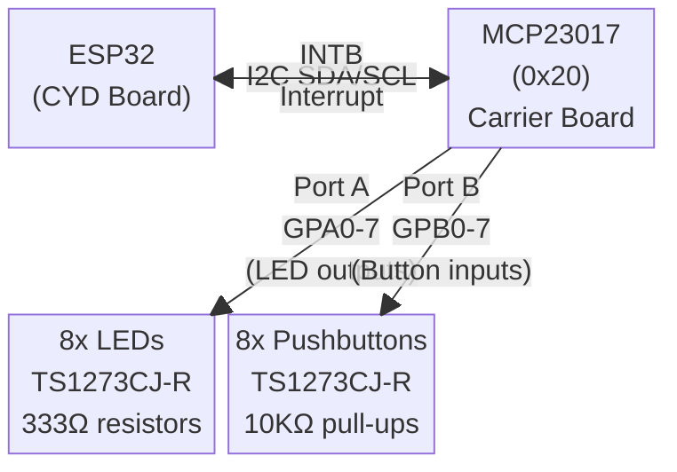
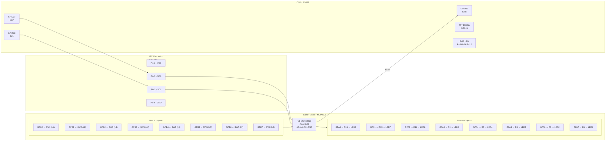

# ETC 9000 - Hardware Documentation

## ESP-NOW Node Registry

| Node | Role | Chip | MAC Address | COM Port | Firmware | Status |
|------|------|------|-------------|----------|----------|--------|
| CYD Monitor | Master / Display | ESP32 | 30:C9:22:32:34:38 | COM5 | CYB_RELAY_COMPUTER_MONITOR | ✅ Active |
| Reg Node 1 | Register slave | ESP32-C3 | AC:A7:04:BC:06:60 | COM28 | RC_REG_ESP32C3 | ✅ Active |
| Reg Node 2 | TBD | ESP32-C3 | TBD | TBD | TBD | ⬜ Pending |
| Reg Node 3 | TBD | ESP32-C3 | TBD | TBD | TBD | ⬜ Pending |
| Reg Node 4 | TBD | ESP32-C3 | TBD | TBD | TBD | ⬜ Pending |
| Reg Node 5 | TBD | ESP32-C3 | TBD | TBD | TBD | ⬜ Pending |
| Reg Node 6 | TBD | ESP32-C3 | TBD | TBD | TBD | ⬜ Pending |
| Reg Node 7 | TBD | ESP32-C3 | TBD | TBD | TBD | ⬜ Pending |
| Reg Node 8 | TBD | ESP32-C3 | TBD | TBD | TBD | ⬜ Pending |

> Flash each new C3, read its MAC from serial output, and fill in the table.

---

## System Block Diagram

## Connection Diagram

## I2C Address
MCP23017 address pins A0, A1, A2 all tied to GND → **Address = 0x20**

## ESP32 Pin Assignment

| ESP32 GPIO | Function        | Notes                                      |
|------------|-----------------|-------------------------------------------|
| 14         | SPI SCK         | TFT display                               |
| 12         | SPI MISO        | TFT display                               |
| 13         | SPI MOSI        | TFT display                               |
| 15         | TFT_CS          | TFT chip select                           |
| 2          | TFT_DC          | TFT data/command                          |
| 21         | TFT_BL          | TFT backlight ⚠️ conflicts with default I2C SDA |
| 4          | LED_RED         | CYD RGB LED (active LOW)                  |
| 16         | LED_GREEN       | CYD RGB LED (active LOW)                  |
| 17         | LED_BLUE        | CYD RGB LED (active LOW)                  |
| 22         | I2C SCL         | CN1 pin 2 → MCP23017 SCL   |
| 27         | I2C SDA         | CN1 pin 3 → MCP23017 SDA   |
| 35         | INTB (input)    | MCP23017 interrupt B — input-only pin     |

> ⚠️ **GPIO21 conflict:** GPIO21 is used for TFT backlight. Do NOT use as default I2C SDA.
> Use `Wire.begin(27, 22)` in code for MCP23017.

## MCP23017 Port Map

| MCP23017 Port | Direction | Function         | Logic        |
|---------------|-----------|------------------|--------------|
| GPA0 (pin 21) | Output    | LED 8            | Active HIGH  |
| GPA1 (pin 22) | Output    | LED 7            | Active HIGH  |
| GPA2 (pin 23) | Output    | LED 6            | Active HIGH  |
| GPA3 (pin 24) | Output    | LED 5            | Active HIGH  |
| GPA4 (pin 25) | Output    | LED 4            | Active HIGH  |
| GPA5 (pin 26) | Output    | LED 3            | Active HIGH  |
| GPA6 (pin 27) | Output    | LED 2            | Active HIGH  |
| GPA7 (pin 28) | Output    | LED 1 (Green)    | Active HIGH  |
| GPB0 (pin 1)  | Input     | Pushbutton SW1   | Active LOW   |
| GPB1 (pin 2)  | Input     | Pushbutton SW2   | Active LOW   |
| GPB2 (pin 3)  | Input     | Pushbutton SW3   | Active LOW   |
| GPB3 (pin 4)  | Input     | Pushbutton SW4   | Active LOW   |
| GPB4 (pin 5)  | Input     | Pushbutton SW5   | Active LOW   |
| GPB5 (pin 6)  | Input     | Pushbutton SW6   | Active LOW   |
| GPB6 (pin 7)  | Input     | Pushbutton SW7   | Active LOW   |
| GPB7 (pin 8)  | Input     | Pushbutton SW8   | Active LOW   |

## Connectors

### Carrier Board Connectors
| Connector | Type              | Pin 1 | Pin 2 | Pin 3 | Pin 4 |
|-----------|-------------------|-------|-------|-------|-------|
| CN1       | JST 4-pin 1.25mm  | VCC   | SCL   | SDA   | GND   |
| P1        | JST 4-pin 1.25mm  | VCC   | SCL   | SDA   | GND   |
| P3        | JST 4-pin 1.25mm  | GND   | GPIO35 status | NC | INTB |
| P4        | IDC 10-pin 2.54mm | 5V (pins 1-4) | | GND (pins 5-8) | |

### CYD Board Connectors
| Connector | Type              | Pin 1 | Pin 2 | Pin 3 | Pin 4 |
|-----------|-------------------|-------|-------|-------|-------|
| CN1       | JST 4-pin 1.25mm  | 3.3V  | GPIO22 (SCL) | GPIO27 (SDA) | GND |
| P1        | JST 4-pin 1.25mm  | 5V (Vin) | TX GPIO1 | RX GPIO3 | GND |
| P3        | JST 4-pin 1.25mm  | GPIO21 (backlight) | GPIO22 | GPIO35 | GND |

---

## ⚠️ CONNECTOR MISMATCH WARNING

> The connectors on the CYD and carrier board look identical (JST 4-pin 1.25mm) but carry **different signals**. Do NOT blindly plug matching connectors together.

### CN1 → CN1 ✅ SAFE — Connect this one
| Pin | CYD Signal | Carrier Signal | Status |
|-----|-----------|----------------|--------|
| 1 | 3.3V | VCC | ✅ OK |
| 2 | GPIO22 (SCL) | SCL | ✅ OK |
| 3 | GPIO27 (SDA) | SDA | ✅ OK |
| 4 | GND | GND | ✅ OK |

### P1 → P1 🚨 DO NOT CONNECT
| Pin | CYD Signal | Carrier Signal | Problem |
|-----|-----------|----------------|---------|
| 1 | 5V (Vin) | VCC (3.3V) | ⚠️ Carrier expects 3.3V, receives 5V |
| 2 | TX GPIO1 (UART) | SCL (I2C) | 🚨 Signal mismatch |
| 3 | RX GPIO3 (UART) | SDA (I2C) | 🚨 Signal mismatch |
| 4 | GND | GND | ✅ OK |

### P3 → P3 🚨 DO NOT CONNECT
| Pin | CYD Signal | Carrier Signal | Problem |
|-----|-----------|----------------|---------|
| 1 | GPIO21 (backlight OUTPUT) | GND | 🚨 **SHORT CIRCUIT** — output driven into ground |
| 2 | GPIO22 (SCL) | GPIO35 status | 🚨 Two drivers on same line |
| 3 | GPIO35 (input) | NC | ✅ NC, no damage |
| 4 | GND | INTB | 🚨 INTB permanently LOW, interrupt fires constantly |

### Correct Wiring Summary
- **CN1 → CN1**: Full connector, safe to plug in ✅
- **INTB**: Single wire only — CYD P3 pin 3 (GPIO35) → Carrier P3 pin 4 (INTB)
- **P1 and P3**: Do NOT connect as full connectors

---

## Assembly Guide

### Connectors to SOLDER on Carrier Board
| Connector | Solder? | Reason |
|-----------|---------|--------|
| CN1 | ✅ YES | Only I2C + power connection needed |
| P1 | ❌ NO | UART/power mismatch with CYD — dangerous |
| P3 | ❌ NO | Pin conflict with CYD — dangerous |
| P4 | ❌ NO | External 5V not needed for USB debug |

### Components to Solder
- CN1 (JST 4-pin 1.25mm) ✅
- U1 MCP23017 DIP-28 ✅
- R1–R18 (all resistors) ✅
- L1–L8 (illuminated pushbuttons) ✅
- LED1 — **see rework note below** ✅

### Cable to Use
- **1x JST 4-pin 1.25mm cable** — CYD CN1 → Carrier CN1
- Waiting on Amazon delivery of 1.25mm JST connectors

### INTB Wire (add later after initial debug)
- Single wire only: CYD P3 pin 3 (GPIO35) → Carrier P3 pin 4 (INTB)
- Do NOT use a 4-pin cable on P3

---

## LED1 Rework

**Original design (PROBLEM):**
- LED1 (green HLMP-CM1A) was connected to carrier P3 pin 2 labeled "GPIO35 status"
- GPIO35 on ESP32 is **INPUT ONLY** — cannot drive an LED

**Rework (SOLUTION):**
- Disconnect LED1 from P3 pin 2
- Rewire LED1 as a simple **VCC power indicator**: VCC → R18 (333Ω) → LED1 → GND
- LED lights whenever board is powered — no GPIO needed
- R18 (333Ω) already on board, reuse it

---

## Key Notes for Code
- `Wire.begin(27, 22)` — use non-conflicting I2C pins
- MCP23017 IODIRA = 0x00 (all Port A = outputs for LEDs)
- MCP23017 IODIRB = 0xFF (all Port B = inputs for buttons)
- MCP23017 GPPUB = 0xFF (enable pull-ups on Port B)
- Read buttons: `Wire.read()` from GPIOB register — LOW = pressed
- Write LEDs: write to GPIOA register — HIGH = LED on
- INTB on GPIO35 → attach interrupt for button events (Phase 2)

---

## Test Plan - Phase 1 (Initial Debug - No INTB wire yet)

### Goal
- Verify MCP23017 found on I2C bus at 0x20
- Control 8 LEDs from CYD TFT display (visual feedback)
- Simulate button presses via Serial command line

### CYD Display (screen_type = 3)
- New screen showing 8 LED indicators (circles, green=ON, grey=OFF)
- Shows current LED state and last button event
- Updates in real time as LEDs toggle

### Serial Commands
| Command | Action |
|---------|--------|
| `L1` – `L8` | Toggle LED 1–8 on carrier board |
| `LA` | All LEDs ON |
| `LX` | All LEDs OFF |
| `B?` | Read and print current button states |
| `SCAN` | I2C scan — confirm MCP23017 at 0x20 |

### Phase 2 (After INTB wire added)
- Interrupt-driven button detection
- Button press shown on TFT display in real time
